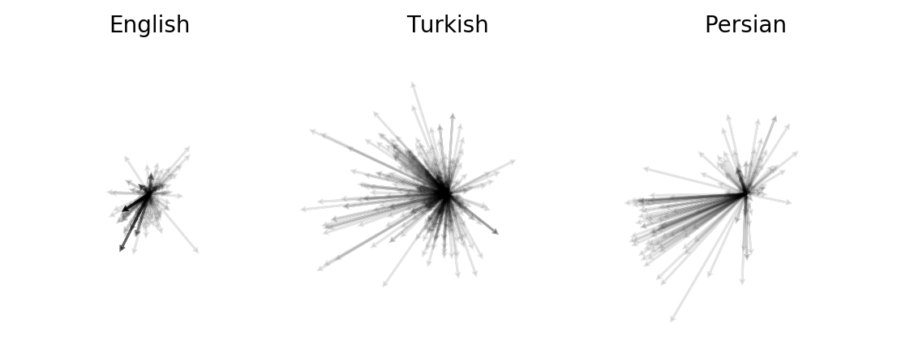

# Morphosemantic Complexity



This repository accompanies the paper:

Thompson, Bill & Lupyan, Gary (2018) Morphosemantic Complexity

which will be presented at the *Measuring Language Complexity* (MLC) workshop, held at the Faculty of Languages NCU (Collegium Humanisticum, Torun) as a satellite event of EVOLANG XII in Torun, Poland in April 2018. The paper is included in this repository in the ```paper``` directory. 

## Morphosemantics

The repo provides tools to compute morphosemantic complexity using our method.

Workflow:

1. Clone this repository.

2. Obtain a semantic model for the langauge you wish to study, and put it in this directory. Unfortunately these files are too heavy to include in this repository, but they are simple to obtain. We used the [Wikipedia-trained Skipgram semantic models](https://github.com/facebookresearch/fastText/blob/master/pretrained-vectors.md) released by [Facebook Artificial Intelligence Research](https://research.fb.com/category/facebook-ai-research-fair/). Be sure to download the .vec version of these models (e.g. [wiki.en.vec](https://s3-us-west-1.amazonaws.com/fasttext-vectors/wiki.en.vec), [wiki.nl.vec](https://s3-us-west-1.amazonaws.com/fasttext-vectors/wiki.nl.vec)). Any model in the same ```.vec``` format should work, though.
 
3. Obtain a .conllu parse for a large text in your language. The shared task for the MLC workshop provides data of this sort for 37 languages. We have included those data in this repo under the ```data``` directory.  

4. To analyse English, for example, run:

```python morphosemantic-complexity.py -v wiki.en.vec -c English.conllu -l English```

This assumes you have moved ```data/UD_English/English.conllu``` into the this directory and downloaded ```wiki.en.vec```. The script will output two files:

- ```English.diffset```, which is a copy of the .conllu file (with duplicate form-lemma pairs removed) enriched with 300-dimensional difference vectors for every form-lemma pair. Use ```--no-cache``` to stop the script saving out these files, which can be large.

- ```English.morphosemantics```, which provides the complexity statistics computed according to our measure.


## Compression

- This repo also includes tools to compute our compression-based measure of complexity. Those tools can be found in ```lang_compression```. See ```lang_compression/README.md``` for more information on how to use these tools.


## Utils 

- The ```utils``` directory provides tools to construct a lemmatized version of the texts provided for the MLC sharted task, and a lightweight wrapper for interfacing with ```.vec``` semantic models. 
